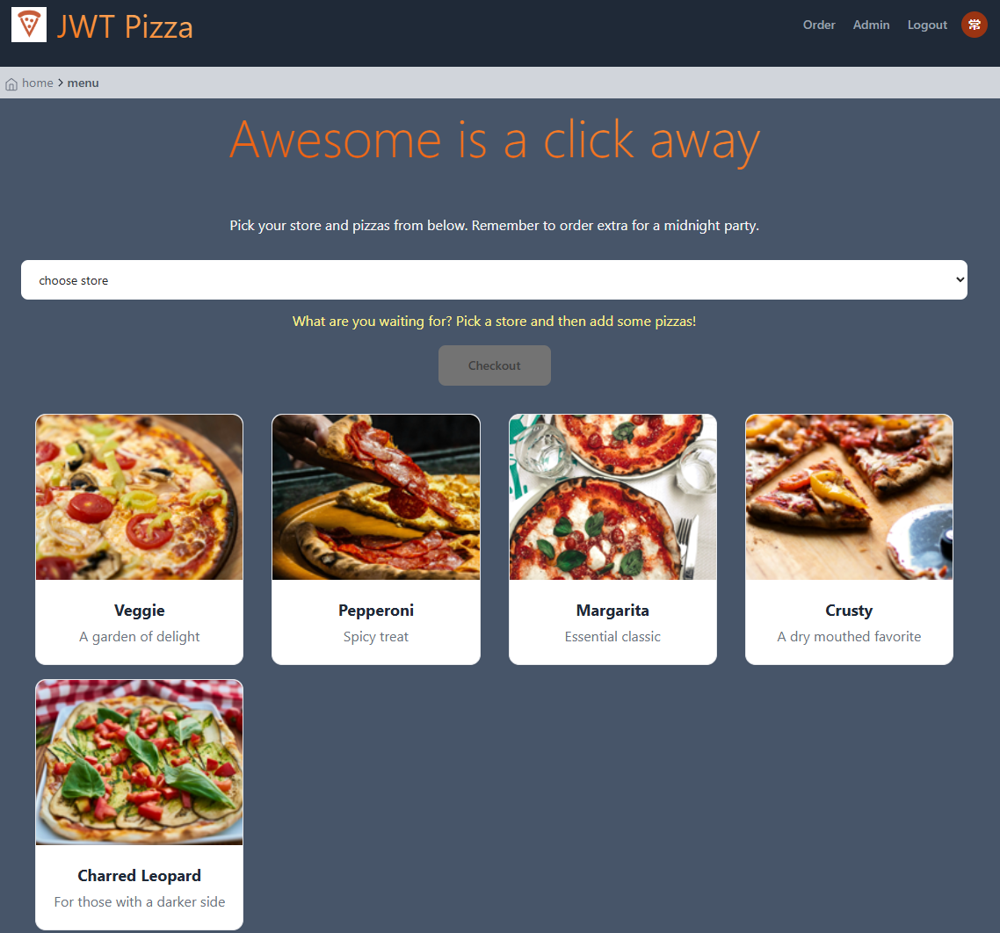
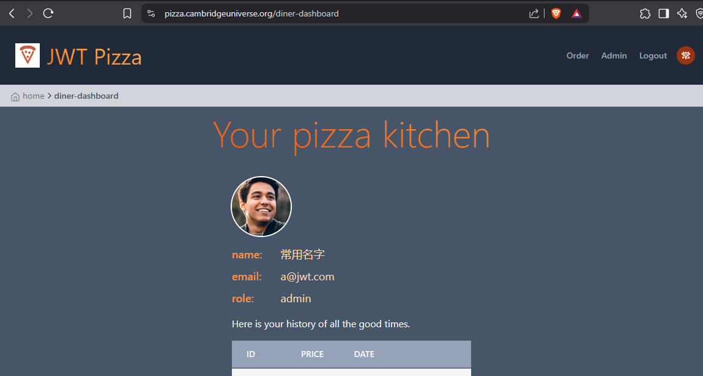
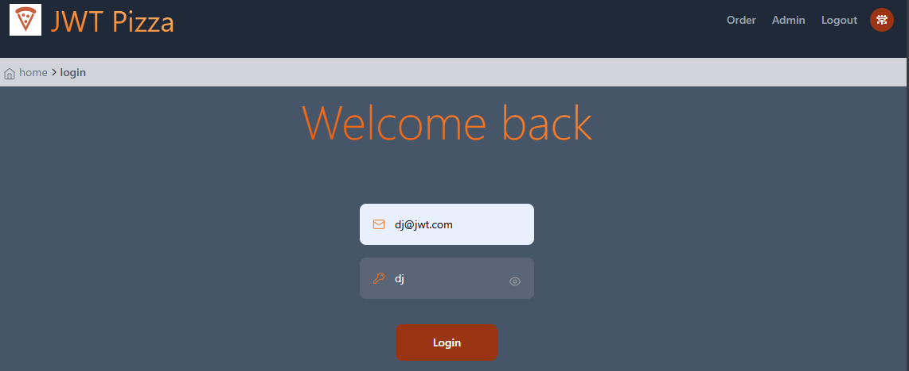
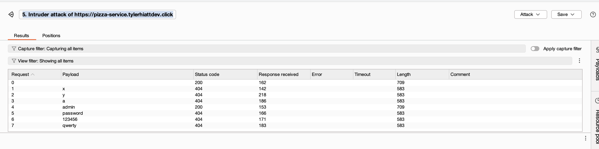
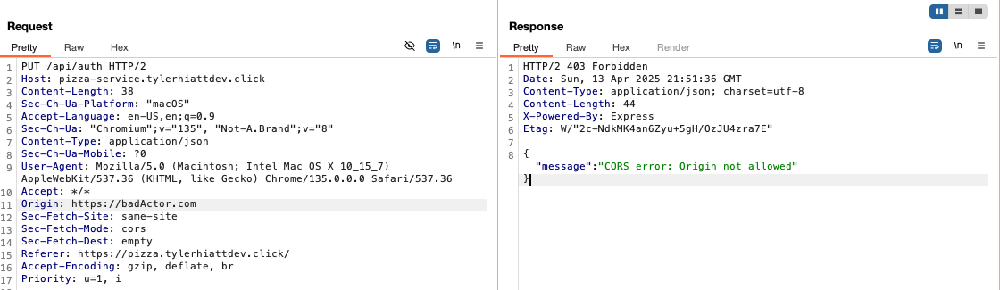
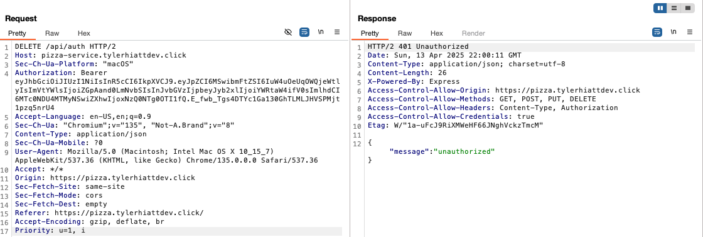
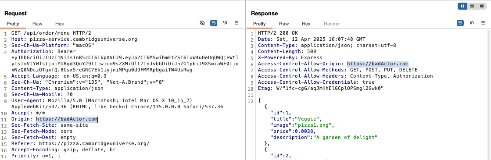
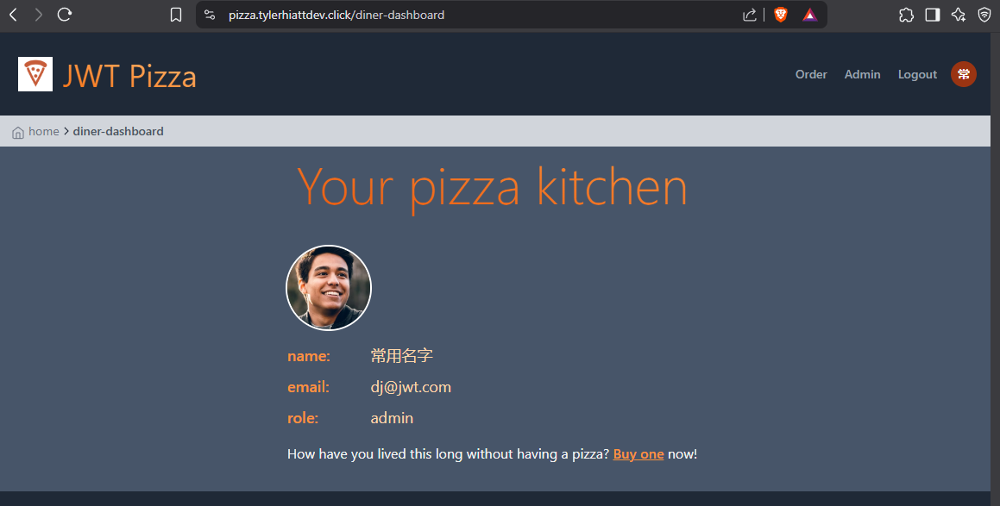
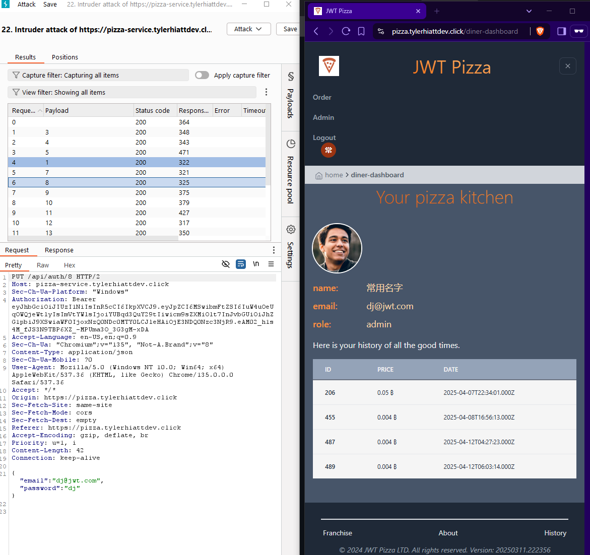
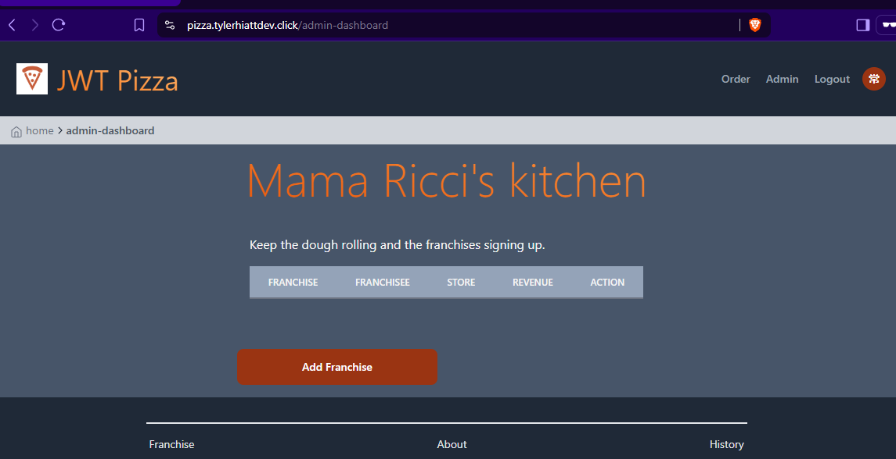

# Deliverable #12: Penetration Testing

**Participants:** Andrew Cambridge and Tyler Hiatt

## Self-Attacks

### Andrew Cambridge

#### Attack 1

| Item           | Result                                                                       |
| -------------- | ---------------------------------------------------------------------------- |
| Date           | April 12, 2025                                                               |
| Target         | pizza.cambridgeuniverse.org                                                  |
| Classification | Injection                                                                    |
| Severity       | 4                                                                            |
| Description    | Unable to penetrate database. It appears that SQL are sufficiently sanitized |
| Images         |    Database data remained unaffected         |
| Corrections    | None at this time.                                                           |

Attack 2  
| Item | Result |
| -------------- | ------------------------------------------------------------------------------ |
| Date | April 12, 2025 |
| Target | pizza.cambridgeuniverse.org |
| Classification | Identification & Authentication Failures |
| Severity | 4 |
| Description | Able to brute force administration password, allowing log in as admin. This allowed unrestricted access to stores and franchises, as well as the authtoken for the Attack 3 |
| Images |    Database data remained unaffected |
| Corrections | Require advanced passwords that aren't known to be common passwords |

Attack 3  
| Item | Result |
| -------------- | ------------------------------------------------------------------------------ |
| Date | April 12, 2025 |
| Target | pizza.cambridgeuniverse.org |
| Classification | Security Misconfiguration |
| Severity | 4 |
| Description | API endpoint exposed the admin users that allows user to update an arbitrary user's email and password. Using the authtoken from Attack 3, control was obtained over mutliple user accounts |
| Images |    Database data remained unaffected |
| Corrections | Remove the endpoint that allows admins to change any user's information. This is a completely unnecessary endpoint in its current configuration. |

### Tyler Hiatt

#### Attack 1

| Item           | Result                                                                                                                                                                                   |
| -------------- | ---------------------------------------------------------------------------------------------------------------------------------------------------------------------------------------- |
| Date           | April 12, 2025                                                                                                                                                                           |
| Target         | pizza.tylerhiattdev.click                                                                                                                                                                |
| Classification | Security Misconfiguration (CORS Policy)                                                                                                                                                  |
| Severity       | 4                                                                                                                                                                                        |
| Description    | Attempted to inject SQL into the login request by manipulating the email field. The server returned a 404 "unknown user" response, indicating that the user input is properly sanitized. |
| Images         |                                                                                                                                                    |
| Corrections    | None at this time. SQL queries appear to be parameterized and safe.                                                                                                                      |

#### Attack 2

| Item           | Result                                                                                                                                                                                                                                                                                    |
| -------------- | ----------------------------------------------------------------------------------------------------------------------------------------------------------------------------------------------------------------------------------------------------------------------------------------- |
| Date           | April 12, 2025                                                                                                                                                                                                                                                                            |
| Target         | pizza.tylerhiattdev.click                                                                                                                                                                                                                                                                 |
| Classification | Security Misconfiguration (CORS Policy)                                                                                                                                                                                                                                                   |
| Severity       | 4                                                                                                                                                                                                                                                                                         |
| Description    | The application only accepted requests from authorized origins. By changing the Origin from https://pizza.tylerhiattdev.click to a different link, the server responded with a 403 Forbidden response, blocking a potentially malicious site to impersonate an authenticated user origin. |
| Images         |                                                                                                                                                                                                                                                            |
| Corrections    | None at this time.                                                                                                                                                                                                                                                                        |

#### Attack 3

| Item           | Result                                                                                                                                                                                                                            |
| -------------- | --------------------------------------------------------------------------------------------------------------------------------------------------------------------------------------------------------------------------------- |
| Date           | April 12, 2025                                                                                                                                                                                                                    |
| Target         | pizza.tylerhiattdev.click                                                                                                                                                                                                         |
| Classification | Identification and Authentication Failures                                                                                                                                                                                        |
| Severity       | 4                                                                                                                                                                                                                                 |
| Description    | Attempted to use a valid session token after the user logged out. The server correctly blocked access to protected endpoints, returning a 401 Unauthorized. This indicates that session tokens are being invalidated as expected. |
| Images         |                                                                                                                                                                                               |
| Corrections    | None at this time. Session tokens are properly revoked upon logout.                                                                                                                                                               |

## Peer-Attacks

### Tyler Hiatt attacking Andrew Cambridge

#### Attack 1

| Item           | Result                                                                                                                                                                                                                                                                                                  |
| -------------- | ------------------------------------------------------------------------------------------------------------------------------------------------------------------------------------------------------------------------------------------------------------------------------------------------------- |
| Date           | April 12, 2025                                                                                                                                                                                                                                                                                          |
| Target         | pizza.cambridgeuniverse.org                                                                                                                                                                                                                                                                             |
| Classification | Security Misconfiguration (CORS Policy)                                                                                                                                                                                                                                                                 |
| Severity       | 2                                                                                                                                                                                                                                                                                                       |
| Description    | The application accepted requests from unauthorized origins. By adding an Origin: https://badActor.com header in Burp Suite, the server responded with a 200 OK and included Access-Control-Allow-Origin: https://badActor.com. This could allow a malicious site to impersonate an authenticated user. |
| Images         |    Successfull cross-origin response.                                                                                                                                                                                                                                  |
| Corrections    | CORS policy should be updated to only allow requests from a whitelist of trusted origins.                                                                                                                                                                                                               |

### Andrew Cambridge attacking Tyler Hiatt

#### Attack 1

| Item           | Result                                                                                                                                                                      |
| -------------- | --------------------------------------------------------------------------------------------------------------------------------------------------------------------------- |
| Date           | April 12, 2025                                                                                                                                                              |
| Target         | pizza.tylerhiattdev.click                                                                                                                                                   |
| Classification | Identification & Authentication Failures                                                                                                                                    |
| Severity       | 4                                                                                                                                                                           |
| Description    | Able to brute force administration password, allowing log in as admin. This allowed unrestricted access to stores and franchises, as well as the authtoken for the Attack 2 |
| Images         |    Database data remained unaffected                                                                                               |
| Corrections    | Require advanced passwords that aren't known to be common passwords                                                                                                         |

#### Attack 2

| Item           | Result                                                                                                                                                                                                                                                                                              |
| -------------- | --------------------------------------------------------------------------------------------------------------------------------------------------------------------------------------------------------------------------------------------------------------------------------------------------- |
| Date           | April 12, 2025                                                                                                                                                                                                                                                                                      |
| Target         | pizza.tylerhiattdev.click                                                                                                                                                                                                                                                                           |
| Classification | Security Misconfiguration                                                                                                                                                                                                                                                                           |
| Severity       | 4                                                                                                                                                                                                                                                                                                   |
| Description    | API endpoint exposed the admin users that allows user to update an arbitrary user's email and password. Using the authtoken from Attack 2, control was obtained over mutliple user accounts. Also deleted all stores and franchies, disabling the ability to make purchase pizzas and make revenue. |
| Images         |    Database data remained unaffected      All stores and franchises deleted                                                                                                                      |
| Corrections    | Remove the endpoint that allows admins to change any user's information. This is a completely unnecessary endpoint in its current configuration.                                                                                                                                                    |

## Summary

During the exercise, we found that the pizza code base was secured against our elementary SQL injection attacks. However, the presence of common admin accounts exposed the sites to significant damage.
Logging in as an admin allowed for the franchises and stores to be deleted, rendering the company's product completely unavailable. Additionally, having an administrator's authtoken allowed for calling
an API endpoint that updates any user's email and password. This allowed bad actors to lock out any number of users based on their numerically ascending ID, as well as gain access to their accounts with
the updated credentials. We also discovered that a CORS misconfiguration initally allowed unauthorized origins to make cross-origin requests with credentials. This posed a threat that could have enabled a malicious third-party sity to impersonate a logged-in user and steal sensitive information.
